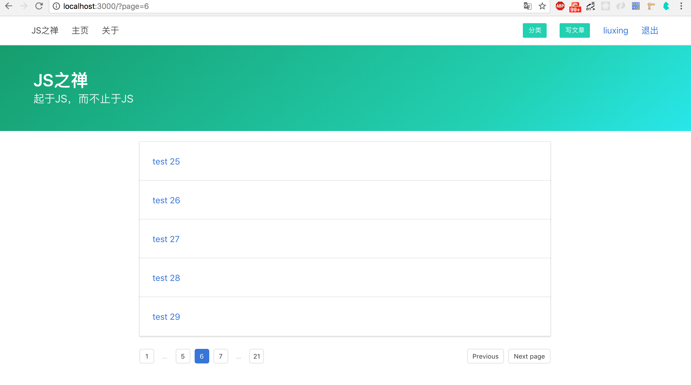

# 分页功能

随着内容的增加，我们的文章会越来越多，全部一次显示出来会增加数据查询耗时，同时不利用用户浏览。我们就需要分页功能。



在MongoDB 终端中运行如下代码新增 101个文章

```javascript
for(var i = 0; i < 101; i++){
	db.posts.insert({
		title: 'test ' + i,
		content: 'test' + i,
		category: ObjectId("5b15f4f45aaaa85ea7bccf65"), 
        author : ObjectId("5b07648464ce83289036ea71")
	})
}
```

现在访问主页，将返回包含101个文章的列表。

## MongoDB 实现分页原理

MongoDB实现分页主要有两种方式

1. 通过skip与limit()方法 实现分页
2. 获取前一页的最后一条记录，查询之后的指定条记录 

本案例将通过第一种方式实现，修改下`routes/posts.js` 的index方法

```javascript
const pageSize = 15
const currentPage = parseInt(ctx.query.page) || 1
const posts = await PostModel.find({}).skip((currentPage - 1) * pageSize).limit(pageSize)
```

我们通过 `/posts?page=2` 的方式来传页码。第二页就应该跳过前15 条记录再返回16到第30条内容。可以在浏览器中更改页码试试

## 实现一个基本的分页器

前面我们了解到分页的原来，现在来渲染分页器。新建一个分页器的组件`components/pagination.html`

```jinja2
// components/pagination.html

<nav class="pagination is-small" role="navigation" aria-label="pagination">
    <a href="/posts?page={{currentPage - 1}}" class="pagination-previous">Previous</a>
    <a href="/posts?page={{currentPage + 1}}" class="pagination-next">Next page</a>
    <ul class="pagination-list">
        
        
        <li><a href="/posts?page={{i}}" class="pagination-link is-current" aria-label="Goto page 1">{{i}}</a></li>
        
        <li><a href="/posts?page={{i}}" class="pagination-link" aria-label="Goto page 1">{{i}}</a></li>
        
        
    </ul>
</nav>

<p class="has-text-centered margin-top is-size-7 has-text-grey">没有更多了... </p>


```

在这分页器中，我们需要总页数，当前页。然后循环显示出每一页的页码

```javascript
// routes/posts.js
module.exports = {
    async index (ctx, next) {
		const pageSize = 15
        const currentPage = parseInt(ctx.query.page) || 1
        const allPostsCount = await PostModel.count()
   		const pageCount = Math.ceil(allPostsCount / pageSize)
        const posts = await PostModel.find(query).skip((currentPage - 1) * pageSize).limit(pageSize)
        await ctx.render('index', {
            title: 'JS之禅',
            posts,
            currentPage,
            pageCount
        }

    }
}
```

通过`count()`方法获取到文章的总数，然后算出页数，再通过`skip().limt()` 来获取当页数据。现在一个基本的分页器就已经实现了。但是有个问题，如果页数特别多没页面上就会显示出很多也页码按钮不出来。

## 高级一点儿的分页器

现在来实现一个高级一点儿的分页器*（即文首的图片中的那样的分页器）*。根据当前页码显示出前后两页，其他显示为三个点。这个分页器的关键在于设置需要显示的起始页和结束页，即循环页码时不再从1开始到pageCount结束，而是从pageStart(起始页)到pageEnd(结束页)结束。我们根据当前页来计算起始和结束

```javascript
// routes/posts.js#index
const pageStart = currentPage - 2 > 0 ? currentPage - 2 : 1
const pageEnd = pageStart + 4 >= pageCount ? pageCount : pageStart + 4
const baseUrl = ctx.path + '?page='
await ctx.render('index', {
    title: 'JS之禅',
    posts,
    currentPage,
    pageCount,
    pageStart,
    pageEnd,
    baseUrl
}
```

修改`components/pagination.html` 来渲染当前页及当前页的上下页

```jinja2

<nav class="pagination is-small margin-top" role="navigation" aria-label="pagination">
    {# 上一页 #}
    
    <a class="pagination-previous">Previous</a>
    
    <a href="{{baseUrl + (currentPage - 1)}}" class="pagination-previous">Previous</a>
    
    {# 下一页 #}
    
    <a class="pagination-previous">Next page</a>
    
    <a href="{{baseUrl + (currentPage + 1)}}" class="pagination-next">Next page</a>
    

    <ul class="pagination-list">
        {# 第一页 #}
        
        <li><a href="{{baseUrl + 1}}" class="pagination-link is-current" aria-label="Goto page 1">1</a></li>
        
        <li><a href="{{baseUrl + 1}}" class="pagination-link" aria-label="Goto page 1">1</a></li>
        

        
        <li><span class="pagination-ellipsis">&hellip;</span></li>
        
        {# 页码 #}
        
        {# 渲染当前页和当前页的上下一页 #}
        
            
            <li><a class="pagination-link is-current" aria-label="Goto page {{i}}">{{i}}</a></li>
            
            <li><a href="{{baseUrl + i}}" class="pagination-link" aria-label="Goto page {{i+1}}">{{i}}</a></li>
            
        
        
        
        <li><span class="pagination-ellipsis">&hellip;</span></li>
        
        {# 最后一页 #}
        
        <li><a href="{{baseUrl + pageCount}}" class="pagination-link is-current" aria-label="Goto page {{pageCount}}">{{pageCount}}</a></li>
        
        <li><a href="{{baseUrl + pageCount}}" class="pagination-link" aria-label="Goto page {{pageCount}}">{{pageCount}}</a></li>
        
    </ul>
</nav>

<p class="has-text-centered margin-top is-size-7 has-text-grey">没有更多了... </p>

```

因为我们还有分类功能，我们还应该让这个分页器在显示分页分类文章的时候也适用，http://localhost:3000/posts?c=nodejs&page=2

修改`routes/posts.js`的index.js

```javascript
async index (ctx, next) {
    console.log(ctx.session.user)
    const pageSize = 5
    const currentPage = parseInt(ctx.query.page) || 1
    // 分类名
    const cname = ctx.query.c
    let cid
    if (cname) {
        // 查询分类id
        const cateogry = await CategoryModel.findOne({ name: cname })
        cid = cateogry._id
    }
    // 根据是否有分类来控制查询语句
    const query = cid ? { category: cid } : {}
    const allPostsCount = await PostModel.find(query).count()
    const pageCount = Math.ceil(allPostsCount / pageSize)
    const pageStart = currentPage - 2 > 0 ? currentPage - 2 : 1
    const pageEnd = pageStart + 4 >= pageCount ? pageCount : pageStart + 4
    const posts = await PostModel.find(query).skip((currentPage - 1) * pageSize).limit(pageSize)
    // 根据是否有分类来控制分页链接
    const baseUrl = cname ? `${ctx.path}?c=${cname}&page=` : `${ctx.path}?page=`
    await ctx.render('index', {
        title: 'JS之禅',
        posts,
        pageSize,
        currentPage,
        allPostsCount,
        pageCount,
        pageStart,
        pageEnd,
        baseUrl
    })
},
```

