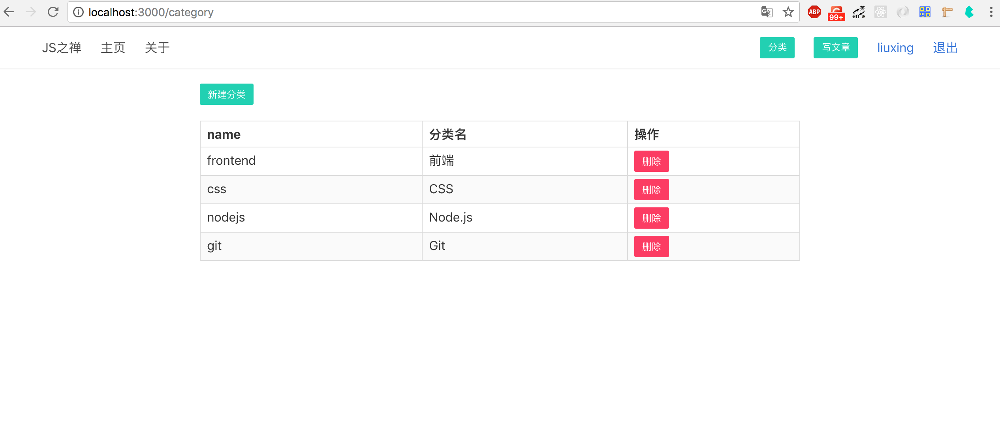

# 文章分类管理

前面我们完成了基本的文章增删改查，这节我们来实现文章分类管理

新建分类 `GET category/new` `POST category/new`

分类列表 `GET /category`

删除文章 `GET /category/:id/detele`

对于分类管理来说，需要管理员才可以操作。即 UserModel `isAdmin: true`  *（直接手动在数据库中更改某个user的`isAdmin`字段为`true`即可 ）*

## 分类模型设计

和之前一样，还是先来设计模型，我们只需要 title：分类名如”前端“，name：用来在url中简洁的显示如"frontend"，desc：分类的描述。当然你只要个 title  字段也是可以的

```javascript
// models/category.js
const mongoose = require('mongoose')
const Schema = mongoose.Schema

const CategorySchema = new Schema({
  name: {
    type: String,
    required: true
  },
  title: {
    type: String,
    required: true
  },
  desc: {
    type: String
  },
  meta: {
    createAt: {
      type: Date,
      default: Date.now()
    }
  }
})

module.exports = mongoose.model('Category', CategorySchema)
```

修改下`models/posts.js` 新增一个category字段

```javascript
...
category: {
    type: Schema.Types.ObjectId,
    ref: 'Category'
}
...
```

## 分类管理主页



新建分类管理控制器 `routes/category.js`，增加一个list方法来展示渲染分类管理的主页

```javascript
const CategoryModel = require('../models/category')

module.exports = {
  async list (ctx, next) {
    const categories = await CategoryModel.find({})
    await ctx.render('category', {
      title: '分类管理',
      categories
    })
  }
}
```

接着编写分类管理的前端界面 `views/category.html`

```jinja2



<div class="container margin-top">
    <div class="columns">
        <div class="column is-8 is-offset-2">
            <a href="/category/new" class="button is-small is-primary">新建分类</a>
            <table class="table margin-top is-bordered is-striped is-narrow is-hoverable is-fullwidth">
                <thead>
                    <tr>
                        <th>name</th>
                        <th>分类名</th>
                        <th>操作</th>
                    </tr>
                </thead>
                <tbody>
                    
                    <tr>
                        <td>{{category.name}}</td>
                        <td>{{category.title}}</td>
                        <td>
                            <a href="/category/{{category._id}}/delete" class="button is-small is-danger">删除</a>
                        </td>
                    </tr>
                    
                </tbody>
            </table>
        </div>
    </div>
</div>

```

现在打开这个页面并没有分类，因为我们还没有添加分类，接下来实现新增分类功能

## 新增分类

在category控制器中新建一个create方法

```javascript
// routes/category.js
async create (ctx, next) {
    if (ctx.method === 'GET') {
        await ctx.render('create_category', {
            title: '新建分类'
        })
        return
    }
    await CategoryModel.create(ctx.request.body)
    ctx.redirect('/category')
}
```

访问 http://localhost:3000/category/new 将返回`create_category.html`页面

```jinja2



<div class="container margin-top">
    <div class="columns">
        <div class="column is-8 is-offset-2">
            <form action="/category/new" method="POST">
                <div class="field">
                    <label class="label">分类名</label>
                    <div class="control">
                        <input name="name" class="input" type="text" placeholder="frontend">
                    </div>
                </div>
                <div class="field">
                    <label class="label">分类标题</label>
                    <div class="control">
                        <input name="title" class="input" type="text" placeholder="前端">
                    </div>
                </div>
                <div class="field">
                    <label class="label">描述</label>
                    <div class="control">
                        <textarea name="desc" class="textarea" placeholder="Textarea"></textarea>
                    </div>
                </div>
                <button class="button is-primary">新建分类</button>
            </form>
        </div>
    </div>
</div>

```


在接受到 post 请求时，将分类数据存入数据库

## 删除分类

删除的功能和删除文章、删除评论基本一样

```javascript
  async destroy (ctx, next) {
    await CategoryModel.findByIdAndRemove(ctx.params.id)
    ctx.flash = { success: '删除分类成功' }
    ctx.redirect('/category')
  }
```

## 新建文章时指定分类

前面完成了分类管理，我们需要把文章指定分类，修改`views/create.html` 和 `views/edit.html` 增加一个分类选择框。

```html
...
<div class="right-box">
    <div class="select is-small">
        <select name="category">
            <option disabled="disabled">分类</option>
            
            <option value={{category._id}}>{{category.title}}</option>
            
        </select>
    </div>
    <button type="submit" class="button is-small is-primary">发布</button>
</div>
...
```

同时修改`routes/post.js` 的create和edit方法，把分类信息传给模板

```javascript
...
const categories = await CategoryModel.find({})
await ctx.render('create', {
    title: '新建文章',
    categories
})
...
```

新建一篇文章，看看数据库，多了一个 category 字段存着分类的id。

```javascript
// routes/posts.js
async show (ctx, next) {
    const post = await PostModel.findById(ctx.params.id)
      .populate([
        { path: 'author', select: 'name' },
        { path: 'category', select: ['title', 'name'] }
    ])
    const comments = await CommentModel.find({ postId: ctx.params.id })
      .populate({ path: 'from', select: 'name' })
    await ctx.render('post', {
        title: post.title,
        post,
        comments
    })
},
```

修改下文章详情页来展示分类名

```jinja2
// views/posts.html
{{marked(post.content) | safe}}
<p>
<a href="/posts?c={{post.category.name}}" class="tag is-primary">{{post.category.title}}</a>
</p>
```

## 权限控制

现在每一个用户登录上去都可以管理分类，我们只想要管理员可以管理。在前面的章节中已经实现了权限控制，只要在相应的路由上使用 `isAdmin` 即可

```javascript
// routes/index.js
...
router.get('/category', isAdmin, require('./category').list)
router.get('/category/new', isAdmin, require('./category').create)
router.post('/category/new', isAdmin, require('./category').create)
router.get('/category/:id/delete', isAdmin, require('./category').destroy)
```

##展示分类文章

前面基本上已经实现了分类功能，现在来实现根据URL参数返回相应的分类文章如 `/posts?c=nodejs` 返回分类为Node.js 的文章

```javascript
// routes/posts.js
async index (ctx, next) {
    const cname = ctx.query.c
    let cid
    if (cname) {
      const cateogry = await CategoryModel.findOne({ name: cname })
      cid = cateogry._id
    }
    const query = cid ? { category: cid } : {}
    const posts = await PostModel.find(query)
    await ctx.render('index', {
        title: 'JS之禅',
        posts
    }
}
```

修改 `posts.js`中的index 方法，通过 `ctx.query` 获取解析的查询字符串, 当没有查询字符串时，返回一个空对象。然后再去通过name去查出分类id，最后通过分类id去查询文章