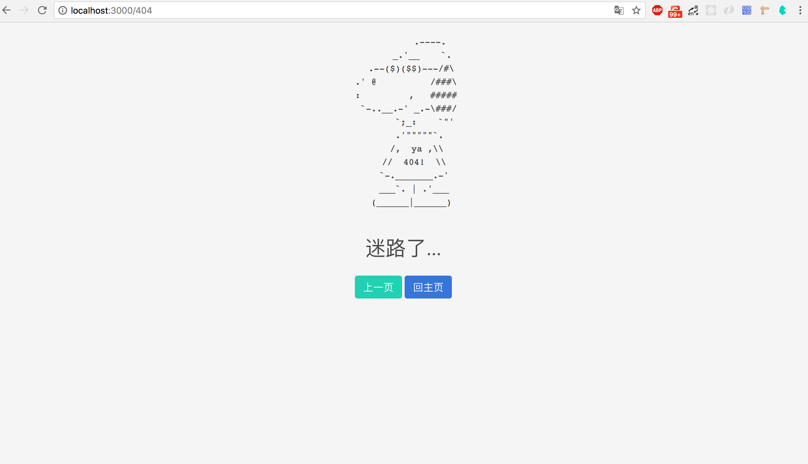

# koa2 错误处理及404

## 404 处理

现在我们访问一个不存在的路由`http://localhost:3000/404` 默认会返回

```diff
Not Found
```

通常我们需要自定义 404 页面，新建一个`views/404.html`

```html


<div class="page-404 has-background-light has-text-centered">
    <pre>
          .----.
       _.'__    `.
   .--($)($$)---/#\
 .' @          /###\
 :         ,   #####
  `-..__.-' _.-\###/
        `;_:    `"'
      .'"""""`.
     /,  ya ,\\
    //  404!  \\
    `-._______.-'
    ___`. | .'___
   (______|______)
    </pre>
    <p class="subtitle is-3">迷路了…</p>
    <a href="javascript:history.back();" class="button is-primary">上一页</a>
    <a href="/" class="button is-link">回主页</a>
</div>



```

修改 routes/index.js，在路由最后加上

```javascript
// 404
app.use(async (ctx, next) => {
    await ctx.render('404', {
      title: 'page not find'
    })
})
```

现在随便访问一个未定义的路由如：`http://localhost:3000/404` 将出现如下页面



## 错误处理

###  try catch

在koa2中，出现错误，会直接将错误栈打印到控制台。因为使用了async、await，可以方便的使用 try-catch 来处理错误，同时我们可以让最外层的中间件，负责所有中间件的错误处理。创建你自己的错误处理程序：

```javascript
app.use(async (ctx, next) => {
  try {
    await next()
  } catch (err) {
    ctx.status = err.statusCode || err.status || 500;
    ctx.body = {
      message: err.message
    };
  }
})
```

注意：这个错误处理中间件应该放在最外层即中间件链的起始处。

我们也可以为它指定自定义错误页，新建一个你自己喜欢的`error.html` 

修改 `middlewares/error_handler.js`

```javascript
module.exports = function errorHandler () {
  return async (ctx, next) => {
    try {
      await next()
    } catch (err) {
      ctx.status = err.statusCode || err.status || 500
      await ctx.render('error', {
        title: ctx.status
      })
    }
  }
}
```

在index.js 引入并使用

```javascript
const error = require('./middlewares/error_handler')
...
app.use(error())
...
```

现在在程序中随便抛出个错误试试

### error 事件

运行过程中一旦出错，Koa 会触发一个`error`事件。监听这个事件，也可以处理错误

```javascript
app.on('error', (err, ctx) =>
  console.error('server error', err)
)
```

需要注意的是，如果错误被`try...catch`捕获，就不会触发`error`事件。这时，必须调用`ctx.app.emit()`，手动释放`error`事件，才能让监听函数生效。修改下之前的错误处理中间件，在渲染自定义错误页后添加如下代码手动释放error 事件。这下控制台也能打印出错误详情

```javascript
ctx.app.emit('error', err, ctx)
```

