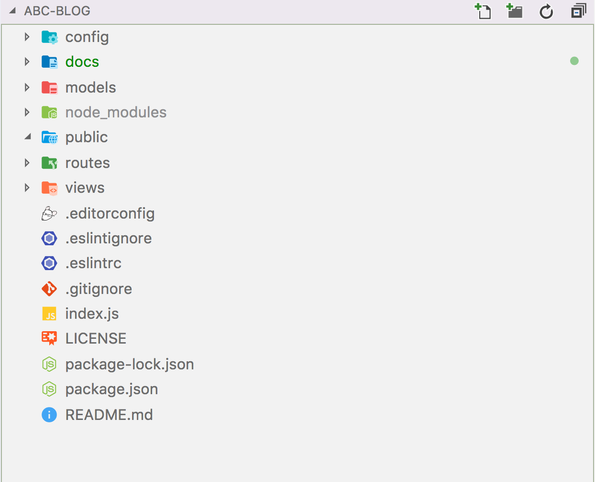

# 开发前的项目配置

通常一个完整健壮的项目，需要良好的团队协作，我们需要统一好编码风格以及代码风格按照一定规范来编码。

我们新建一个项目目录 blog

```bash
$ mkdir blog && cd blog
```

在项目目录下运行 `npm init` 生成package.json 初识化项目

## 规划项目目录结构

在blog 下建立如下目录及文件，现在在这个项目中有`models` 层  、`views` 视图、`routes` 路由等



我们还用到了ESLint 来检查代码风格，使用editorconfig来统一编码风格，使用Git 管理项目，commitizen来统一Commit message。

现在这几个目录都是空的，但Git不跟踪空目录，我们在目录下建立了个`.gitkeep`  .gitkeep 是一个约定俗成的文件名并不带有特殊规则。我们还用到了`.gitignore`文件，文件的内容为我们要忽略提交到Git的文件，Git就会自动忽略这些文件。例如：

```
.DS_Store
node_modules
*.log
```

## 使用editorconfig

在项目中我们使用 `.editorconfig` 文件 统一代码风格 ，该文件用来定义项目的编码规范如：缩进方式、换行符，编码等。编辑器的行为会与.editorconfig 文件中定义的一致，并且其优先级比编辑器自身的设置要高，这在多人合作开发项目时十分有用而且必要。

```
# editorconfig.org
root = true

[*]
indent_style = space
indent_size = 2
end_of_line = lf
charset = utf-8
trim_trailing_whitespace = true
insert_final_newline = true

[*.md]
trim_trailing_whitespace = false
```

更多配置请查看 [http://editorconfig.org](http://editorconfig.org) 

## 使用commitizen 

在这项目中我们使用了Git 来作为版本控制器，如果你还不太会GIt 请先阅读 [一篇文章，教你学会Git](https://mp.weixin.qq.com/s/-TC07TQoiTNRUJIdBv46SQ ) ，写好Commit message 则可参考 [更优雅的使用Git](https://mp.weixin.qq.com/s/wH-msSi8pBkcZBux0yLhng )

使用npm 全局安装

```
$ npm install -g commitizen
```

在项目中使用 angular 的 commit 规范

```
$ commitizen init cz-conventional-changelog --save-dev --save-exact
```

然后我们就可以愉快的使用 git cz 代替 git commit 命令了。当然我们也可也将其加到npm script 中

```
"script": {    
	"commit": "git cz"
}
```

然后直接使用`npm run commit` 或者使用 `git cz`


## 使用ESLint

ESLint 是一个插件化的javascript代码检测工具，它可以用于检查常见的JavaScript代码错误，也可以进行代码风格检查，这样我们就可以根据自己的喜好指定一套ESLint配置，然后应用到所编写的项目上，从而实现辅助编码规范的执行，有效控制项目代码的质量。

在开始使用ESLint之前，我们需要通过NPM来安装它：

```bash
$ npm install -g eslint
# 我们也可以将它安装到项目开发依赖中
$ npm install --save-dev eslint
```

接下来就可以使用 `eslint*.js` 来检查代码。我们还可以与 Git hooks 配合，在提交时自动检查

```bash
$ npm install --save-dev lint-staged husky
```

[husky](https://www.npmjs.com/package/husky) 可以方便我使用Git hooks,我们用来配置在提交代码是检查代码

[lint-staged](https://github.com/okonet/lint-staged) 每次提交只检查本次提交所修改的文件

关于代码风格，我们使用[ JavaScript standard style](https://github.com/standard/standard)

```bash
$ npm install --save-dev eslint-config-standard eslint-plugin-standard eslint-plugin-promise eslint-plugin-import eslint-plugin-node
```

然后配置 `.eslintrc `

```
{
  "extends": "standard"
}
```

你也可以直接使用`eslint —init`  来初始化 eslint 配置，eslint 会创建一个 .eslintrc.json 的配置文件，同时自动安装相关模块，省去了我们手动安装配置

## 使用Git hooks自动检查代码 

我们在package.json 稍做配置即可

```json
// 配置husky 在提交代码时运行lint-staged
"husky": {
  "hooks": {
    "pre-commit": "lint-staged"
   }
},
// 配置lint-staged 只在检查本次提交的代码
"lint-staged": {
  "*.js": [
     "eslint --fix",
     "git add"
  ]
}
```

到此我们的这个项目配置的差不多了，也是一套比较流行的工作流。

最后来把我们要用到的Koa相关的包给安装着，具体开发还是放到下一节

```bash
$ npm install --save koa koa-router koa-views koa-static
```

