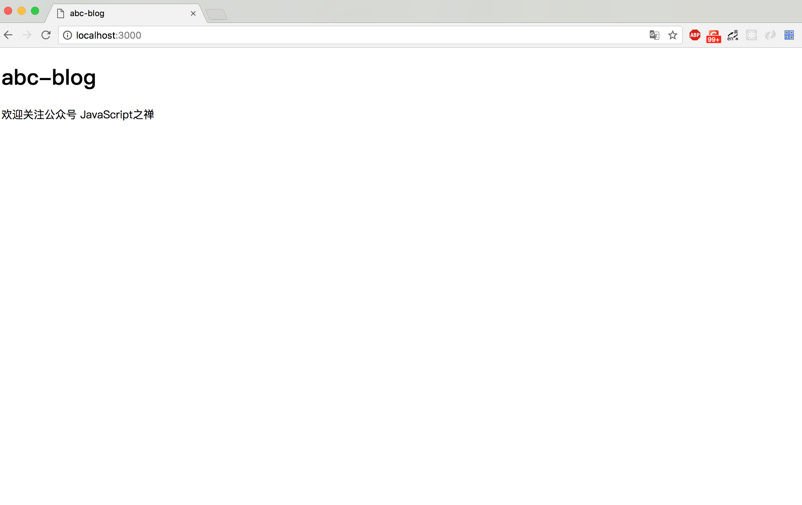

# 来把项目跑起来

上一节我们规划好了目录，配置好了开发环境。现在就来将项目跑起来，本节主要是讲视图、控制器之类的串起来。

## router

我们先来配置下路由，前面说了，路由放在`routes` 目录下.

```javascript
// routes/index.js
const router = require('koa-router')()

module.exports = (app) => {
  router.get('/', require('./home').index)
  router.get('/about', require('./about').index)

  app
    .use(router.routes())
    .use(router.allowedMethods())
}

// routes/home.js
module.exports = {
  async index (ctx, next) {
    await ctx.render('index', {
      title: 'abc-blog',
      desc: '欢迎关注公众号 JavaScript之禅'
    })
  }
}
```

看看index.js

```javascript
// index.js
const Koa = require('koa')
const router = require('./routes')

const app = new Koa()

router(app)

app.listen(3000, () => {
  console.log('server is running at http://localhost:3000')
})
```

## 配置模板引擎

模板引擎（Template Engine）是一个将页面模板和数据结合起来生成 html 的工具。在这个项目中我们使用了 [nunjucks](https://mozilla.github.io/nunjucks) 这个模板引擎，nunjucks移植与Python的jinja2，使用起来基本一样

```bash
$ npm i koa-views nunjucks --save
```

使用koa-views 来配置 nunjucks

```javascript
const Koa = require('koa')
const path = require('path')
const views = require('koa-views')
const router = require('./routes')

const app = new Koa()

app.use(views(path.join(__dirname, 'views'), {
  map: { html: 'nunjucks' }
}))
···
```

将所有模板放在 `views` 目录下，在`views` 目录下新建一个`index.html`

```jinja2
<!DOCTYPE html>
<html lang="en">
<head>
  <meta charset="UTF-8">
  <meta name="viewport" content="width=device-width, initial-scale=1.0">
  <meta http-equiv="X-UA-Compatible" content="ie=edge">
  <title>{{title}}</title>
</head>
<body>
<h1>{{title}}</h1>
<p>{{ desc }}</p>
</body>
</html>
```

然后可以通过 `ctx.render` 函数 渲染模板，第一个参数是模板的名字，它会自动去views 找到对应的模板并渲染，第二个参数是传输的给模板的数据。如下，我们渲染了index.html并传给了它title与desc

```javascript
// routes/home.js
module.exports = {
  async index (ctx, next) {
    await ctx.render('index', {
      title: 'abc-blog',
      desc: '欢迎关注公众号 JavaScript之禅'
    })
  }
}
```

打开浏览器将得到如下内容

关于nunjucks的具体语法可查看官方文档

https://mozilla.github.io/nunjucks/cn/templating.html

## 配置静态资源

我们将使用 [koa-static](https://www.npmjs.com/package/koa-static) 插件来处理静态资源，并且把所有静态资源放在public目录下

```javascript
···
const serve = require('koa-static')
···
app.use(serve(
  path.join(__dirname, 'public')
))
···
```

现在处理数据库相关的处理没加入，我们的这个项目基本上已经成型。在开发阶段，我们使用

```bash
$ nodemon index.js
```

来启动项目，免去手动重启的问题