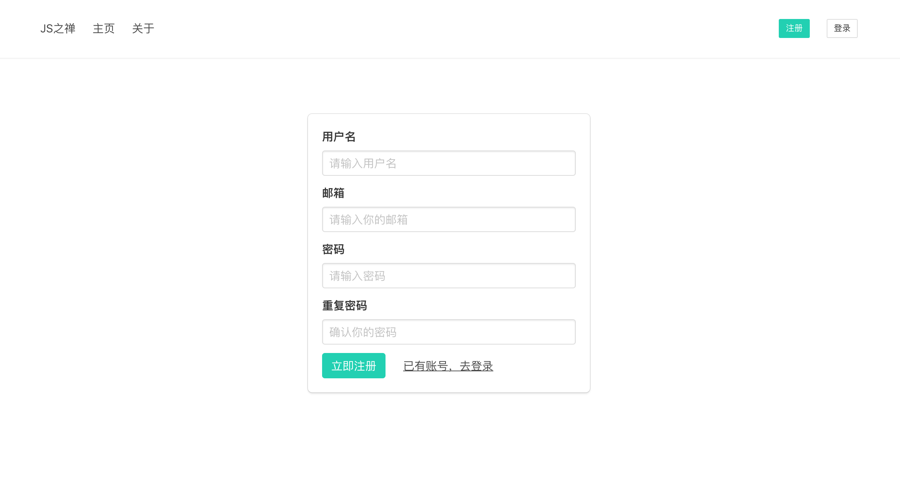
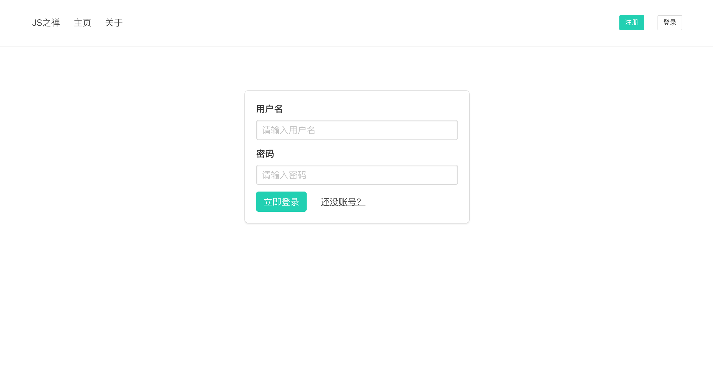
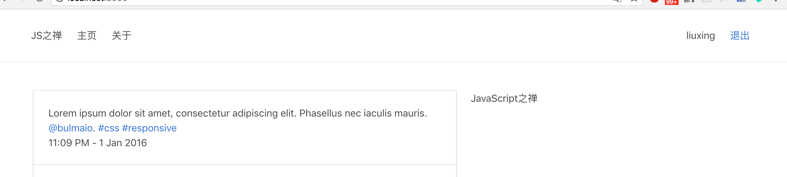

# 用户注册与登录

这一节开始，我就来实现具体的功能了，这一节要实现的是用户登录注册与登出。

在前一节已经规划好了`UserSchema` ，这儿增加了一个`isAdmin` 字段来判断是不是管理员

```javascript
...
const UserSchema = new Schema({
  name: {
    type: String,
    required: true, // 表示该字段是必需的
    unique: true // 表示该字段唯一
  },
  email: {
    type: String,
    required: true,
    unique: true
  },
  password: {
    type: 'string',
    required: true
  },
  isAdmin: {
    type: Boolean,
    default: false
  },
  meta: {
    createAt: {
      type: Date,
      default: Date.now()
    }
  }
})

module.exports = mongoose.model('User', UserSchema)
```

定义了用户表的 schema，并通过schema生成导出了 User 这个 model

 ## cookie与session

由于HTTP协议是无状态的协议，所以服务端需要记录用户的状态时，就需要用某种机制来识具体的用户，这个机制就是Session.典型的场景比如购物车，当你点击下单按钮时，由于HTTP协议无状态，所以并不知道是哪个用户操作的，所以服务端要为特定的用户创建了特定的Session，用用于标识这个用户，并且跟踪用户，这样才知道购物车里面有几本书。这个Session是保存在服务端的，有一个唯一标识。在服务端保存Session的方法很多，内存、数据库、文件都有。集群的时候也要考虑Session的转移，在大型的网站，一般会有专门的Session服务器集群，用来保存用户会话，这个时候 Session 信息都是放在内存的，使用一些缓存服务比如Memcached之类的来放 Session。


思考一下服务端如何识别特定的客户？这个时候Cookie就登场了。每次HTTP请求的时候，客户端都会发送相应的Cookie信息到服务端。实际上大多数的应用都是用 Cookie 来实现Session跟踪的，第一次创建Session的时候，服务端会在HTTP协议中告诉客户端，需要在 Cookie 里面记录一个Session ID，以后每次请求把这个会话ID发送到服务器，我就知道你是谁了。有人问，如果客户端的浏览器禁用了 Cookie 怎么办？一般这种情况下，会使用一种叫做URL重写的技术来进行会话跟踪，即每次HTTP交互，URL后面都会被附加上一个诸如 sid=xxxxx 这样的参数，服务端据此来识别用户。


Cookie其实还可以用在一些方便用户的场景下，设想你某次登陆过一个网站，下次登录的时候不想再次输入账号了，怎么办？这个信息可以写到Cookie里面，访问网站的时候，网站页面的脚本可以读取这个信息，就自动帮你把用户名给填了，能够方便一下用户。这也是Cookie名称的由来，给用户的一点甜头。
所以，总结一下：
Session是在服务端保存的一个数据结构，用来跟踪用户的状态，这个数据可以保存在集群、数据库、文件中。
Cookie是客户端保存用户信息的一种机制，用来记录用户的一些信息，也是实现Session的一种方式。


koa2原生功能只提供了cookie的操作，但是没有提供session操作。session就只用自己实现或者通过第三方中间件实现。这里我们使用[koa-session](https://www.npmjs.com/package/koa-session) 来实对session的支持。

下载使用

```bash
$ npm install --save koa-session
```

```javascript
...
const session = require('koa-session')
...
app.keys = ['somethings']

app.use(session({
  key: CONFIG.session.key,
  maxAge: CONFIG.session.maxAge
}, app))

```


## 用户注册页面

上一节中我们已经实现了一个最简单的用户注册。来新建个`views/signup.html`

```jinja2
 

<div class="container">
    <div class="box sign-box">
        <form action="/signup" method="POST">
            <div class="field">
                <label class="label">用户名</label>
                <div class="control">
                    <input class="input" name="name" type="text" placeholder="请输入用户名">
                </div>
            </div>
            <div class="field">
                <label class="label">邮箱</label>
                <div class="control">
                    <input class="input" name="email" type="email" placeholder="请输入你的邮箱">
                </div>
            </div>
            <div class="field">
                <label class="label">密码</label>
                <div class="control">
                    <input class="input" name="password" type="password" placeholder="请输入密码">
                </div>
            </div>
            <div class="field">
                <label class="label">重复密码</label>
                <div class="control">
                    <input class="input" name="repassword" type="password" placeholder="确认你的密码">
                </div>
            </div>
            <div class="field is-grouped">
                <div class="control">
                    <button class="button is-primary">立即注册</button>
                </div>
                <div class="control">
                    <a href="/signin" class="button is-text">已有账号，去登录</a>
                </div>
            </div>
        </form>
    </div>
</div>

```

## 获取POST 请求数据

对于POST请求的处理，koa2没有封装获取参数的方法，需要我们自己去解析*（通过解析上下文context中的原生node.js请求对象req，将POST表单数据解析成query string（例如：`a=1&b=2&c=3`），再将query string 解析成JSON格式）* 我们可以自己写，也可以直接使用第三方中间件。[koa-bodyparser](https://www.npmjs.com/package/koa-bodyparser)中间件可以把koa2上下文的formData 数据解析到ctx.request.body中

安装使用

```bash
$ npm install --save koa-bodyparser
```

```javascript
// index.js
...
const bodyParser = require('koa-bodyparser')
..
app.use(bodyParser())
```

现在就可以使用ctx.request.body 获取到POST过来的参数了。

## 密码加密

这儿我们使用了`bcryptjs` 来对密码进行加密加盐。

```javascript
const bcrypt = require('bcryptjs')
const UserModel = require('../models/user')

module.exports = {
  async signup (ctx, next) {
    if (ctx.method === 'GET') {
      await ctx.render('signup', {
        title: '用户注册'
      })
      return
    }
    // 生成salt
    const salt = await bcrypt.genSalt(10)
    let { name, email, password } = ctx.request.body
    // TODO 合法性校验
    // 对密码进行加密
    password = await bcrypt.hash(password, salt)
    const user = {
      name,
      email,
      password
    }
    // 储存到数据库
    const result = await UserModel.create(user)
    ctx.body = result
  }
}
```

## 用户注册

在前面这步我们已经实现了用户的注册，添加如下路由

```javascript
...
router.get('/signup', require('./user').signup)
router.post('/signup', require('./user').signup)
..
```

现在访问http://localhost:3000/signup 将看见如下页面



注册用户，就可以在数据库中查看到该用户。注意这儿斌没有做一些校验工作，可以自己先实现。

## 用户登录

现在我们来完成登录页，在`routes/user.js` 中新增signin方法

```javascript
async signin (ctx, next) {
    await ctx.render('signin', {
       title: '用户登录'
    })
 }
```

新建用户登录页`signin.html`

```jinja2


<div class="container">
    <div class="box sign-box">
        <form action="/signin" method="POST">
            <div class="field">
                <label class="label">用户名</label>
                <div class="control">
                    <input class="input" name="name" type="text" autocomplete="off" placeholder="请输入用户名">
                </div>
            </div>
            <div class="field">
                <label class="label">密码</label>
                <div class="control">
                    <!-- 禁止自动填充用户名密码 -->
                    <input type="password" style="position: absolute;left: 9999999px" />
                    <input class="input" name="password" type="password" placeholder="请输入密码">
                </div>
            </div>
            <div class="field is-grouped">
                <div class="control">
                    <button class="button is-primary">立即登录</button>
                </div>
                <div class="control">
                    <a href="/signup" class="button is-text">还没账号？</a>
                </div>
            </div>
        </form>
    </div>
</div>

```

新增路由

```javascript
// routes/index.js
...
router.get('/signin', require('./user').signin)
router.post('/signin', require('./user').signin)
...
```

现在访问http://localhost:3000/signup 将看见如下登录页



用户登录时，根据post过来的name去数据库中查找有无该用户，如果有，就校验穿上来的密码与数据库中的是否一致。数据库中的密码使用了bcrypt加密。我们使用`bcrypt.compare()` 来比对

```javascript
async signin (ctx, next) {
    if (ctx.method === 'GET') {
      await ctx.render('signin', {
        title: '用户登录'
      })
      return
    }
    const { name, password } = ctx.request.body
    const user = await UserModel.findOne({ name })
    if (user && await bcrypt.compare(password, user.password)) {
      ctx.session.user = {
        _id: user._id,
        name: user.name,
        isAdmin: user.isAdmin,
        email: user.email
      }
      ctx.redirect('/')
    } else {
      ctx.body = '用户名或密码错误'
    }
  }
```

为了能够直观的看见我们登录了，修改一下`views/header.html`

```jinja2
<nav id="navbar" class="navbar has-shadow is-spaced">
    <div class="container">
        <div class="navbar-brand">
            <a class="navbar-item" href="#">JS之禅</a>
            <div class="navbar-burger burger" data-target="navMenu">
                <span></span>
                <span></span>
                <span></span>
            </div>
        </div>
        <div id="navMenu" class="navbar-menu">
            <div class="navbar-start">
                <a class="navbar-item" href="/">主页</a>
                <a class="navbar-item" href="/about">关于</a>
            </div>
            <div class="navbar-end">
                
                <div class="navbar-item">
                    {{ctx.session.user.name}}
                </div>
                <div class="navbar-item">
                    <a href="/signout">退出</a>
                </div>
                
                <div class="navbar-item">
                    <a class="button is-small is-primary" href="/signup">注册</a>
                </div>
                <div class="navbar-item">
                    <a class="button is-small" href="/signin">登录</a>
                </div>
                
            </div>
        </div>
    </div>
</nav>
```

这里我们根据 session 判断用户是否登录，登录了就显示用户名以及退出按钮，如未登录则显示登录注册按钮。

在view中是不能直接获取到ctx的，除非每次都通过模板引擎传过来。为了方便，我们使用`ctx.state` 来将信息传给前端视图，这样我们就可以直接使用了。修改index.js在路由前面加上如下代码

```javascript
..
app.use(async (ctx, next) => {
  ctx.state.ctx = ctx
  await next()
})

router(app)
..
```

现在用你之前注册的用户登录试试。	



## 用户登出

最后我们来实现用户登出 `GET /signout`，将session.user设置为null即可

```
signout (ctx, next) {
    ctx.session = null
    ctx.redirect('/')
}
```

