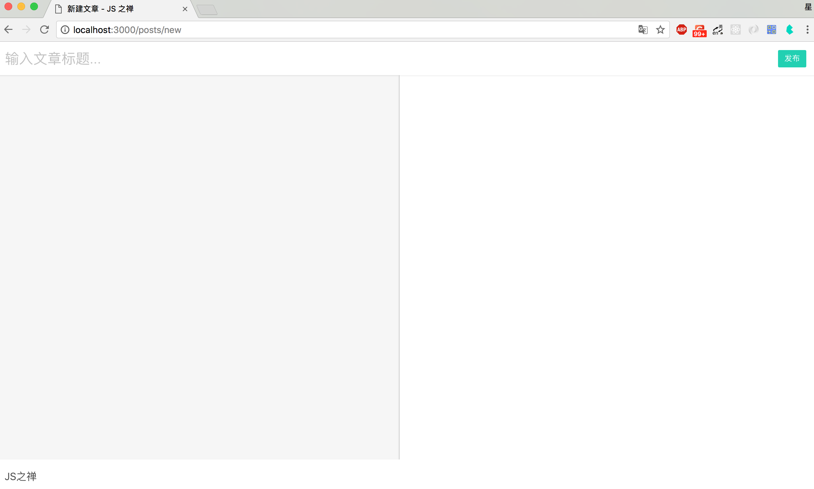
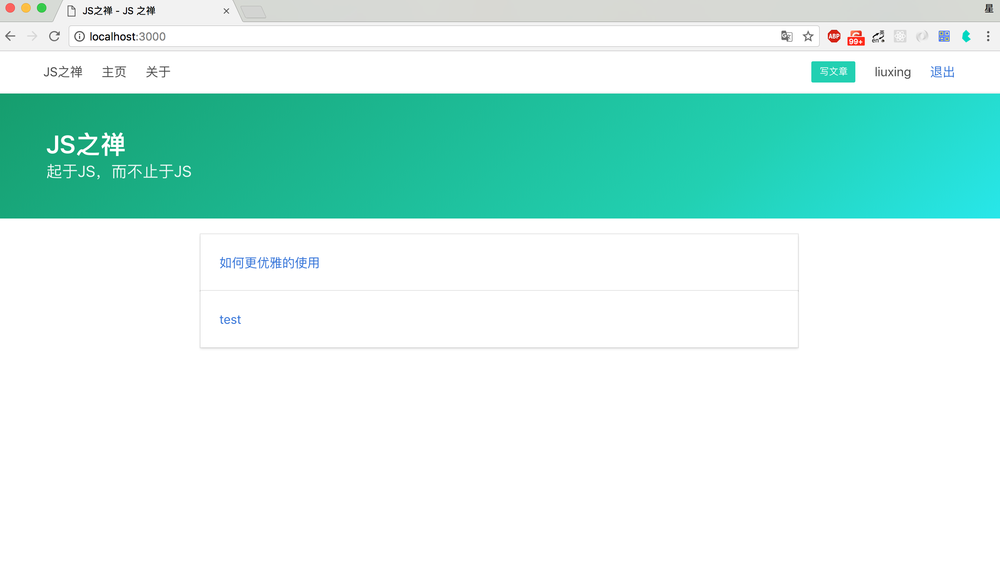
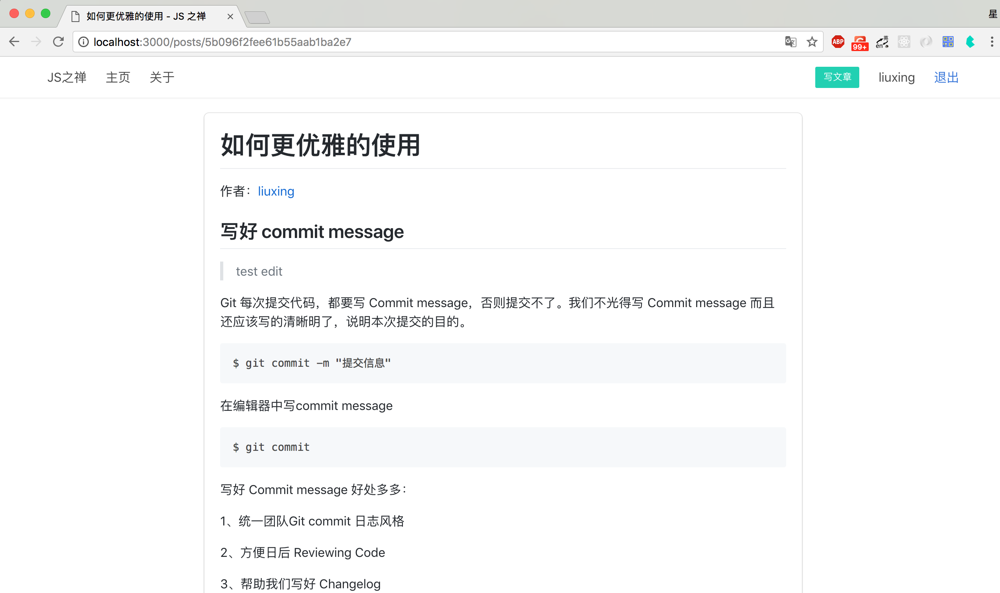

# 文章的增删改查

这节我们来实现一个文章相关功能:

发表文章 `GET posts/new` `POST posts/new`

文章详情 `GET posts/:id`

修改文章 `GET posts/:id/edit `   `POST posts/:id/edit`

删除文章 `GET /posts/:id/detele`

文章列表直接就在 `GET /` 和 `GET /posts`显示

```javascript
// routes/index.js
...
router.get('/', require('./posts').index)
...
router.get('/posts', require('./posts').index)
router.get('/posts/new', require('./posts').create)
router.post('/posts/new', require('./posts').create)
router.get('/posts/:id', require('./posts').show)
router.get('/posts/:id/edit', require('./posts').edit)
router.post('/posts/:id/edit', require('./posts').edit)
router.get('/posts/:id/delete', require('./posts').destroy)
...
```

## 文章模型设计

```javascript
// models/post.js
const mongoose = require('mongoose')
const Schema = mongoose.Schema

const PostSchema = new Schema({
  author: {
    type: Schema.Types.ObjectId,
    ref: 'User',
    require: true
  },
  title: {
    type: String,
    required: true
  },
  content: {
    type: String,
    required: true
  },
  pv: {
    type: Number,
    default: 0
  },
  meta: {
    createdAt: {
      type: Date,
      default: Date.now()
    },
    updatedAt: {
      type: Date,
      default: Date.now()
    }
  }
})

PostSchema.pre('save', function (next) {
  if (this.isNew) {
    this.meta.createdAt = this.meta.updatedAt = Date.now()
  } else {
    this.meta.updatedAt = Date.now()
  }
  next()
})

module.exports = mongoose.model('Post', PostSchema)
```

这个文章模型，有作者、标题、内容、pv、创建时间、修改时间等。当然还应该有分类，额，我们之后再加。

上面我们用到了`pre()` 前置钩子来更新文章修改时间。

## 文章发表

先来实现创建文章的功能。新建个创建文章页`views/create.html`



```jinja2


<form action="/posts/new" method="POST">
    <header class="editor-header">
        <input name="title" class="input is-shadowless is-radiusless"  autofocus="autofocus" type="text" placeholder="输入文章标题...">
        <div class="right-box">
            <button type="submit" class="button is-small is-primary">发布</button>
        </div>
    </header>
    <div id="editor">
        <textarea name="content" class="input" name="content"></textarea>
        <div class="show content markdown-body"></div>
    </div>
</form>
<nav class="navbar has-shadow">
    <div class="navbar-brand">
        <a class="navbar-item" href="/">
            JS之禅
        </a>
    </div>
</nav>

<script src="https://cdn.bootcss.com/marked/0.3.19/marked.min.js"></script>
<script>
    var input = $('#editor .input')
    $('#editor .show').html(marked(input.val()))
    input.on('input', function() {
        $('#editor .show').html(marked($(this).val()))
    })
</script>


```

这儿我们实现了一个最简陋的Markdown编辑器*(函数去抖都懒得加)* 

[Markdown: Basics （快速入门）](http://wowubuntu.com/markdown/basic.html)

新建控制器`routes/posts.js`，并把create方法挂到路由

```javascript
module.exports = {
    async create (ctx, next) {
        await ctx.render('create', {
            title: '新建文章'
        })
    }
}
```

访问http://localhost:3000/posts/new 试试。

接下来，我们在`routes/posts.js` 引入文章Model

```
const PostModel = require('../models/post')
```

修改create 方法，在GET时显示页面，POST时接收表单数据并操作数据库

```javascript
...
async create (ctx, next) {
    if (ctx.method === 'GET') {
      await ctx.render('create', {
        title: '新建文章'
      })
      return
    }
    const post = Object.assign(ctx.request.body, {
      author: ctx.session.user._id
    })
    const res = await PostModel.create(post)
    ctx.flash = { success: '发表文章成功' }
    ctx.redirect(`/posts/${res._id}`)
}
...
```

发表一篇文章试试！到数据库看看刚刚新建的这条数据。*注意：这儿我们并没有做任何校验*

## 文章列表与详情

上面，在发表文章后将跳转到文章详情页，但是先什么都没有，现在就来实现它，在`posts.js` 新建`show`方法用来显示文章

```javascript
async show (ctx, next) {
    const post = await PostModel.findById(ctx.params.id)
      .populate({ path: 'author', select: 'name' })
    await ctx.render('post', {
      title: post.title,
      post,
      comments
    })
}
```

这儿用到了`populate` 方法，MongoDB是非关联数据库，它没有关系型数据库`joins`特性，但是有时候我们还是想引用其它的文档，为了决这个问题，`Mongoose`封装了一个[`Population`](http://mongoosejs.com/docs/populate.html)功能。使用`Population`可以实现在一个 **document** 中填充其他 **collection(s)** 的 **document(s)**。

文章详情模板

```jinja2



<div class="container margin-top">
    <div class="columns">
        <div class="column is-8 is-offset-2">
            <div class="box markdown-body">
                <h1>{{post.title}}</h1>
                <div>
                    作者：<a href="/user/{{post.author._id}}">{{post.author.name}}</a>
                    
                    <div class="is-pulled-right">
                        <a class="button is-small is-primary" href="/posts/{{post._id}}/edit">编辑</a>
                        <a class="button is-small is-danger" href="/posts/{{post._id}}/delete">删除</a>
                    </div>
                    
                </div>
                {{marked(post.content) | safe}}
            </div>
        </div>
    </div>
</div>

```

在模板里我们用到marked，我们需要将marked挂到ctx.state上

```javascript
...
const marked = require('marked')
...
marked.setOptions({
  renderer: new marked.Renderer(),
  gfm: true,
  tables: true,
  breaks: false,
  pedantic: false,
  sanitize: false,
  smartLists: true,
  smartypants: false
})

...
app.use(async (ctx, next) => {
  ctx.state.ctx = ctx
  ctx.state.marked = marked
  await next()
})
...
```

接下来实现文章列表页

```javascript
const PostModel = require('../models/post')

module.exports = {
  async index (ctx, next) {
    const posts = await PostModel.find({})
    await ctx.render('index', {
      title: 'JS之禅',
      desc: '欢迎关注公众号 JavaScript之禅',
      posts
    })
  }
}
```

修改我们的主页模板

```jinja2



<section class="hero is-primary is-bold">
    <div class="hero-body">
        <div class="container">
            <h1 class="title">
                JS之禅
            </h1>
            <h2 class="subtitle">
                起于JS，而不止于JS
            </h2>
        </div>
    </div>
</section>
<div class="container margin-top">
    <div class="columns">
        <div class="column is-8 is-offset-2">
            
            <div class="card">
                <div class="card-content">
                    <div class="content">
                        <a href="/posts/{{post._id}}">{{post.title}}</a>
                    </div>
                </div>
            </div>
            
        </div>
    </div>
</div>

```

现在访问下http://localhost:3000 你将看到文章列表，点击文章将打开文章详情页




##文章编辑与删除

现在来实现文章的编辑修改，在`posts.js` 新建`edit`方法

```javascript
async edit (ctx, next) {
    if (ctx.method === 'GET') {
      const post = await PostModel.findById(ctx.params.id)
      if (!post) {
        throw new Error('文章不存在')
      }
      if (post.author.toString() !== ctx.session.user._id.toString()) {
        throw new Error('没有权限')
      }
      await ctx.render('edit', {
        title: '更新文章',
        post
      })
      return
    }
    const { title, content } = ctx.request.body
    await PostModel.findByIdAndUpdate(ctx.params.id, {
      title,
      content
    })
    ctx.flash = { success: '更新文章成功' }
    ctx.redirect(`/posts/${ctx.params.id}`)
}
  
```

`edit.html` 与`create.html` 基本一致。不过有了文章的数据

```jinja2


<form action="/posts/{{post._id}}/edit" method="POST">
    <header class="editor-header">
        <input name="title" value={{post.title}} class="input is-shadowless is-radiusless" type="text" placeholder="输入文章标题...">
        <div class="right-box">
            <button type="submit" class="button is-small is-primary">更新</button>
        </div>
    </header>
    <div id="editor">
        <textarea  autofocus="autofocus" name="content" class="input" name="content">{{post.content}}</textarea>
        <div class="show content markdown-body"></div>
    </div>
</form>
<nav class="navbar has-shadow">
    <div class="navbar-brand">
        <a class="navbar-item" href="/">
            JS之禅
        </a>
    </div>
</nav>

<script src="https://cdn.bootcss.com/marked/0.3.19/marked.min.js"></script>
<script>
    var input = $('#editor .input')
    $('#editor .show').html(marked(input.val()))
    input.on('input', function() {
        $('#editor .show').html(marked($(this).val()))
    })
</script>


```

删除功能很简单，找到文章、判断用户是否有权限删除，然后删除即可

```javascript
// routes/posts.js
async destroy (ctx, next) {
    const post = await PostModel.findById(ctx.params.id)
    if (!post) {
        throw new Error('文章不存在')
    }
    console.log(post.author, ctx.session.user._id)
    if (post.author.toString() !== ctx.session.user._id.toString()) {
        throw new Error('没有权限')
    }
    await PostModel.findByIdAndRemove(ctx.params.id)
    ctx.flash = { success: '删除文章成功' }
    ctx.redirect('/')
}
```

动手试试，并思考思考还有那些问题？