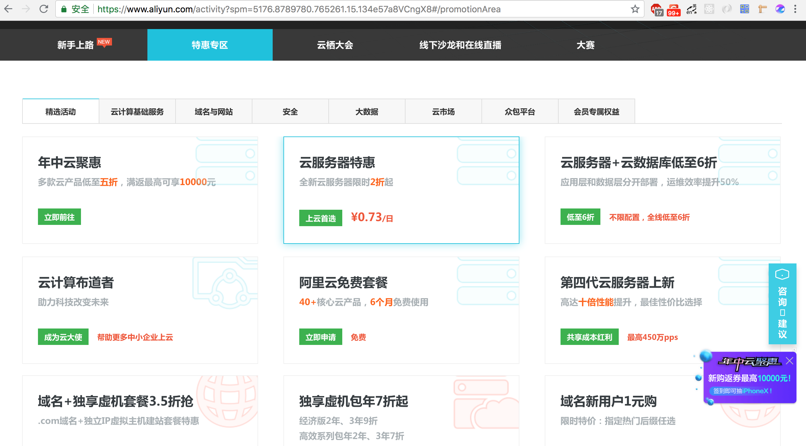
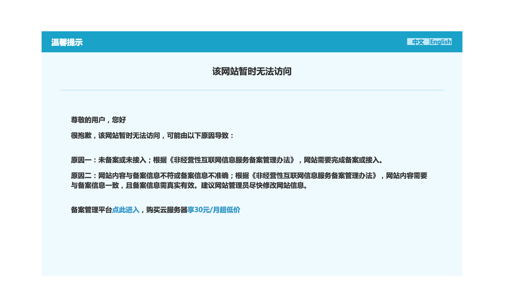

# 域名与服务器

## IP与域名

在互联网中信息太多，我们需要一个资源地址来定位我们的网站。这儿我们就要提到IP了比如 "202.101.139.188" 的形式。它为每个连接在Internet上的主机分配的一个在全世界范围内唯一的32位地址。IP地址通常圆点(半角句号)分隔的4个十进制数字表示。

但是记IP地址也太麻烦了吧，因此在IP地址的基础上又发展出一种符号化的地址方案，来代替数字型的IP地址。每一个符号化的地址都与特定的IP地址对应，这样网络上的资源访问起来就容易得多了。这个与网络上的数字型IP地址相对应的字符型地址，就被称为域名。它同IP地址一样都是用来表示一个单位、机构或个人在网上的一个确定的名称或位置。所不同的是比IP地址较有亲和力，更容易被人们记记和乐于使用。

 ## 域名选购

在选取域名的时候，我们应该首选简短好记或是有一定意义的域名：纯英文、纯数字、拼音等。在哪儿注册域名：阿里云、腾讯云、新网以及国外的Name.com、Namecheap、Godaddy等等服务商都可以（如何选？哪家便宜选哪家）

这儿用阿里云做演示百度或者谷歌阿里云域名注册 打开万网*（阿里云域名服务前身是万网）* https://wanwang.aliyun.com/domain/  在首页的大输入框输入你想要注册的域名，点击查域名即可。然后选好你中意的后缀，登录付款即可。

## 服务器选购

现在云计算平台太多腾讯云、阿里云、青云、XX云，国外大的亚马逊AWS、Microsoft Azure、小的DigitalOcean 、vultr。关于如何选择，优先选择大的服务商，优先选择国内的*（国内主机需备案）*。当然个人也可以直接买国外的vultr的玩玩，便宜、还可以搭建SS。

阿里云经常做活动，点击导航栏的最新活动进入到活动页面



可以看到各种活动，甚至还有免费套餐，你都可以看看。选择服务器操作系统时选择Ubuntu 16.04，如果只有14.04 可以选择就选择了之后在控制台更换系统即可 *（当然你也可以自由选择你熟悉的Linux发行版本 如CentOS）* 在购买时，应该会让你设置root 密码。

购买完成后进入到控制台，在你的服务器详情页看看你的Ubuntu版本是否是16.04，如果不是，停止这个服务器，点击更换系统盘即可*（更换时需要设置root密码）*

## 连接服务器

在mac上我们，我们直接在命令行中使用ssh命令连接

```bash
$ssh root@你的服务器IP 
```

之后会出现一段提示说无法确认host主机的真实性，只知道它的公钥指纹，问你还想继续连接吗？输入yes，然后就会要求你输入之前设置的root用户的密码

在Windows上使用xshell来连接服务器，百度搜索xshell 然后下载，安装时候根据提示安装就可以，选择Free 非商业用途。打开Xshell，打开时候会弹出新建链接的窗口，点击新建，根据提示输入服务器IP及端口


点击【用户身份验证】,在这里输入你的用户名和密码。然后点击【确定】按钮开始链接。


当然你也可以在xshell的终端直接使用ssh命令来连接主机，与Mac使用方法一样

## 域名解析

在我们选购号域名与服务器后(这儿以阿里云为例)，进入【控制台】，找到【域名与网站(万网)】->【云解析DNS】选着对应的域名，设置解析，对于网站应用我们需要加上www和@的A记录，其记录值为你的服务器IP，现在阿里云有个新手引导，只需要填上记录值即你的服务器IP。如果你是买的阿里云的主机，访问域名，你将愉快的看见一个备案提示。进行备案即可。




