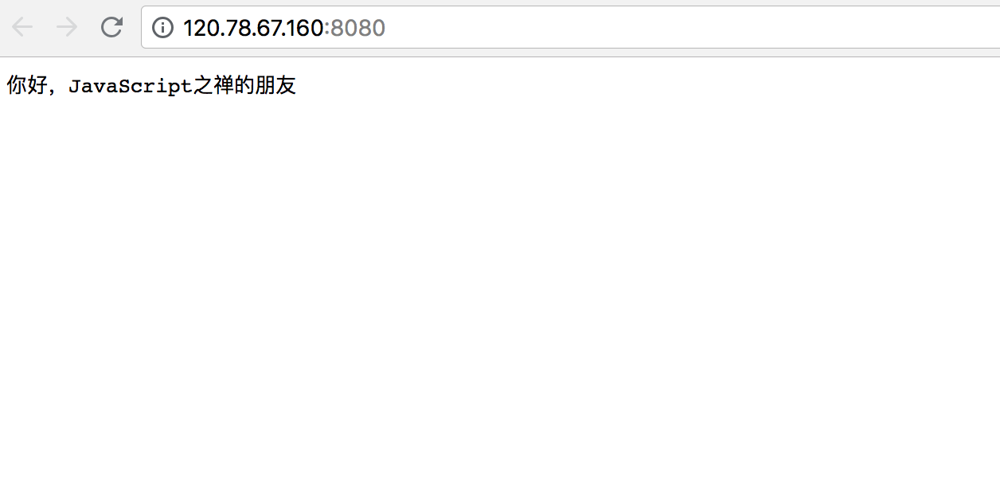
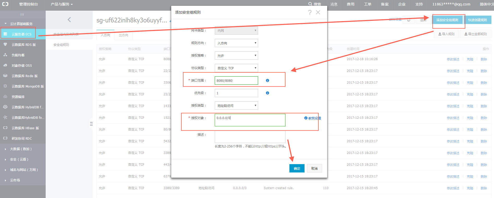

# 搭建Node.js生产环境

前面的章节中，我们聊到过[nvm的使用](https://github.com/liuxing/node-blog/blob/master/docs/1.1Node.js%E7%9A%84%E5%AE%89%E8%A3%85%E4%B8%8E%E9%85%8D%E7%BD%AE.md#%E4%BD%BF%E7%94%A8-nvm) ，在服务器上将使用它来管理不同版本的node以适应不同项目的需要*(如果你没这个需要直接安装特定版本的Node也是没问题的)*。

使用curl 或者 wget 安装

```bash
curl -o- https://raw.githubusercontent.com/creationix/nvm/v0.33.11/install.sh | bash
```

```bash
wget -qO- https://raw.githubusercontent.com/creationix/nvm/v0.33.11/install.sh | bash
```

执行完这个脚本后，输入 `nvm` 并不能使用。需要在新的终端打开才能开始使用*(重新连接服务器)*，现在输入`nvm`就可以看到nvm的提示信息。我们使用最新的长期支持版现在为Carbon 8.11.3

```bash
$ nvm install lts/carbon
```

安装完毕后，输入`node -v` 就可以查看node版本。当然你还可以下载其他版本的node，比如下载最新稳定版的 node

```bash
$ nvm install node
```

然后使用`nvm use xx`  来指定版本，使用`nvm alias default xx`来指定默认版本。

在安装搭建本地环境的时候就说过由于GFW的原因，国内访问npm会很慢，[如何解决前面聊过](https://github.com/liuxing/node-blog/blob/master/docs/1.1Node.js%E7%9A%84%E5%AE%89%E8%A3%85%E4%B8%8E%E9%85%8D%E7%BD%AE.md#%E4%B8%80%E4%BA%9B%E6%9C%89%E7%94%A8%E7%9A%84%E5%B7%A5%E5%85%B7)，这儿就不再讲了，如果你用的国外的主机就不用管npm的网络问题了。

## 使用pm2

当项目要跑在服务器上时，不能单单依靠`node index.js` 来启动，我们需要强大一点的进程管理工具来部署应用，[pm2](https://www.npmjs.com/package/pm2)无疑是最主流的选择

安装pm2

```bash
$ npm i -g pm2
```

现在再在服务器上来个hello，在用户根目录下新建一个app.js

```
const http = require('http')

const port = 8080

const server = http.createServer((req, res) => {
  res.statusCode = 200
  res.setHeader('Content-Type', 'text/plain')
  res.end('你好，JavaScript之禅的朋友\n')
})

server.listen(port, () => {
  console.log(`服务器运行在 http://127.0.0.1:${port}/`)
})
```

`node app.js`将它跑起来，这下在浏览器输入ip:端口 就可以访问到这个应用了。



如果你用的阿里云，它有安全组设置，需要配置一下，将端口开放。



现在出现一个问题，退出或是关闭连接时，这个应用也会停掉。机智的你应该已经想到了使用`nohup`命令了吧

```bash
$ nohup node app.js
```

如何关闭

```bash
# 先通过端口查看对应的pid
$ lsof -i:8080
COMMAND  PID    USER   FD   TYPE DEVICE SIZE/OFF NODE NAME
node    1839 manager   10u  IPv4  19519      0t0  TCP *:http-alt (LISTEN)
# kill对应的pid
$ kill 1839
```

如果直接用这个能满足我们，那还上面的pm2不就白介绍了。

使用pm2 来做这些工作很方便，同时很强大，方便查看node进程的状态，也支持性能监控，进程守护，负载均衡等功能

**启动应用**

```bash
$ pm2 start app.js
```

**重启**

```bash
pm2 restart app.js
```

**结束应用** 

可以先通过`pm2 list`获取应用的名字（--name指定的）或者进程id。

```bash
$ pm2 stop app_name|app_id
```

**列出所有pm2启动的进程**

```bash
$ pm2 list
```