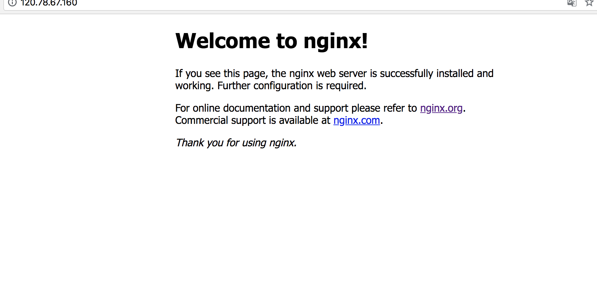

# 使用 Nginx 反向代理

*Nginx* (engine x)是，一款轻量级网页服务器、反向代理服务器及电子邮件（IMAP/POP3）代理服务器。由伊戈尔·赛索耶夫为俄罗斯访问量第二的Rambler.ru站点（俄文：Рамблер）开发的。其特点是占有内存少，并发能力强，且稳定、功能丰富。已经被各大互联网公司广泛使用。

在生产环境中使用Nginx反向代理Node.js是个很好的习惯，性能好、方便配置、易于扩展…除此之外还可以实现负载均衡。

> 有的同学不理解什么是反向代理，有反向就有正向。举个通俗易懂的例子：我们通过国外的代理来翻墙访问Google，这里的翻墙代理就**正向代理**；我们打10086人工服务，我们不关心电话那头是谁，是男是女，能有人接听，解决问题就行。那么这里的10086总机号码就是**反向代理**

前面的章节中，我们在端口8080启动了一个node服务。但是想启动一个在80端口*(HTTP的默认端口是80 )*咋办？如果服务器上只有一个服务，你要直接监听80端口也是可以的，但是需要root权限，因为1024以内的端口都需要root权限才能开启，同时也需要放大node的权限，这样也不免有些麻烦。你的服务器上有多个站点需要占用80端口，只需要让node监听本地的端口，然后通过Nginx反向代理，就可以将多个站点域名指向同一台服务器了。

## 安装Nginx

在Ubuntu可以直接是用apt-get来安装Nginx

```bash
# 下载安装
$ sudo apt-get install nginx
# 查看版本
$ nginx -v
# nginx version: nginx/1.10.3 (Ubuntu)
```

现在直接访问服务器IP，将可以看见如下Nginx的欢迎页面




## 配置Nginx

进入到`/etx/nginx/conf.d`目录下，新建域名对应的配置文件如`jszen.com.conf`，随便叫啥名字都可以，关键这儿使用域名的名字主要是好记

```bash
$ vi jszen.com.conf
```

```nginx
upstream jszen {
  server 127.0.0.1:8080;
}

server {
  listen 80;
  server_name 120.78.67.160; 
  # 若要域名访问，这儿配置为域名即可如 test.com, www.test.com

  location / {
    proxy_pass http://jszen;
    proxy_set_header Host $host;
    proxy_set_header X-Real-IP $remote_addr;
    proxy_set_header X-Forwarded-For $proxy_add_x_forwarded_for;
    proxy_set_header X-NginX-Proxy  true;
    proxy_redirect off;
  }
}
```

测试配置文章是否有错误

```bash
$ sudo nginx -t
```

将Nginx重启，使配置生效

```bash
$ sudo nginx -s reload
# 或
$ sudo service nginx reload
```

现在访问IP地址就可以看见，服务器返回了

```javascript
你好，JavaScript之禅的朋友
```
